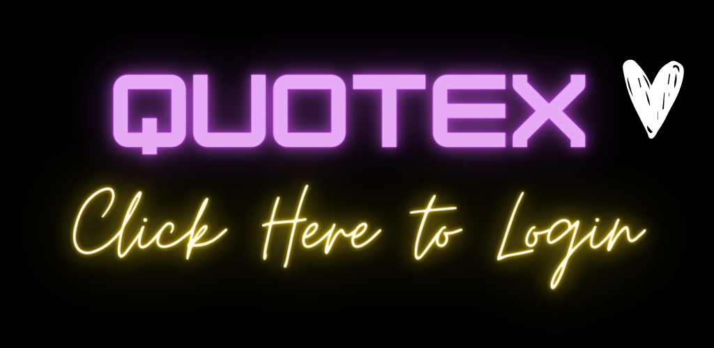

<div align="center">
  <h1>Binary Trading AI Bot</h1>
</div>

<!-- Image with button link -->
<!-- text link no images -->
<a href="https://panditrader.vercel.app/quotex">
   
</a>

## Project Description:

Binary Trading AI Bot is a project idea aimed at developing an AI-powered bot for binary trading. The bot utilizes machine learning algorithms to predict the direction of the next candle (whether it will move up or down) with high accuracy. Additionally, the bot incorporates Natural Language Processing (NLP) techniques to analyze trading outcomes and user feedback, continuously learning and improving its predictive capabilities over time.

<div>
  <h2> Key Features : </h2>
</div>

<a href="https://panditrader.vercel.app/quotex">
   
</a>

<a href="https://panditrader.vercel.app/quotex">
   
</a>

1. **Predictive Modeling:** Utilize machine learning algorithms to analyze historical trading data and forecast the direction of the next candle.

2. **Real-time Data Integration:** Incorporate real-time market data feeds to ensure the bot has access to the latest information for making informed trading decisions.

3. **NLP Feedback Loop:** Develop an NLP module to analyze trading outcomes and user feedback, enabling the bot to adjust its strategies based on sentiment analysis and reinforcement learning.

4. **User Interface:** Design a user-friendly interface for traders to interact with the bot, providing visualization of trading signals, performance metrics, and customizable settings.

5. **Risk Management:** Implement robust risk management features to mitigate potential losses, including options for setting stop-loss levels and risk tolerance parameters.

6. **Performance Monitoring:** Enable comprehensive monitoring of the bot's performance through detailed analytics and reporting tools, tracking key performance indicators such as accuracy rates and profitability.

7. **Security and Compliance:** Ensure data security and compliance with regulatory standards, implementing encryption protocols and adhering to best practices for privacy protection.

8. **Continuous Improvement:** Foster a culture of continuous improvement through regular updates and enhancements based on user feedback and market dynamics.

<br>

[](https://panditrader.vercel.app/quotex)

<hr>

## How to Contribute ?

Contributions to the Binary Trading AI Bot project are welcome and encouraged! Here's how you can contribute:

- **Code Contributions:** Help develop new features, improve existing functionality, or fix bugs by submitting pull requests.
- **Documentation:** Contribute to the project's documentation by writing README files, tutorials, or API documentation.
- **Testing:** Assist in testing the bot's functionality and providing feedback on its performance.
- **Feedback:** Share your thoughts, suggestions, and ideas for improving the project by opening issues or participating in discussions.

## Getting Started:

To get started with the Binary Trading AI Bot project, follow these steps:

1. Clone the repository to your local machine:
   ```
   git clone https://github.com/Ayushpanditmoto/Trading-Bot.git
   ```

2. Install the necessary dependencies:
   ```
   cd binary-trading-ai-bot
   pip install -r requirements.txt
   ```

3. Start contributing by working on existing issues or proposing new features!

<hr>
<!-- Open Source Programs -->
  <div>
    <h2> Open Source Programs</h2>
  </div>

  <table border="1" cellpadding="10">
        <tr>
            <td rowspan="2">
                
            </td>
            <td>
                <strong>GSSOC 2024</strong>
            </td>
        </tr>
        <tr>
            <td>
               This project is part of GirlScript Summer of Code. We enthusiastically invite community contributions to help refine and enhance Trading-Bot.
            </td>
        </tr>
    </table>
<hr>

<!-- Code of conduct -->
<div>
<h2> Code of Conduct</h2>
</div>

Please note that this project is released with a [Contributor Code of Conduct](/Code_Of_Conduct.md). By participating in this project you agree to abide by its terms.

<hr>

<!-- License -->
<div>
<h2> License</h2>
</div>

This project is licensed under the [MIT License](./LICENSE).

<hr>
 <!-- Cotributors -->
<div>
  <h2> Contributors</h2>
</div>

Thank you for contributing to our project! Your support is greatly appreciated in making Trading-Bot even better. 😊

<center>
<a href="https://github.com/Ayushpanditmoto/Trading-Bot/graphs/contributors">
  
</a>
</center>
